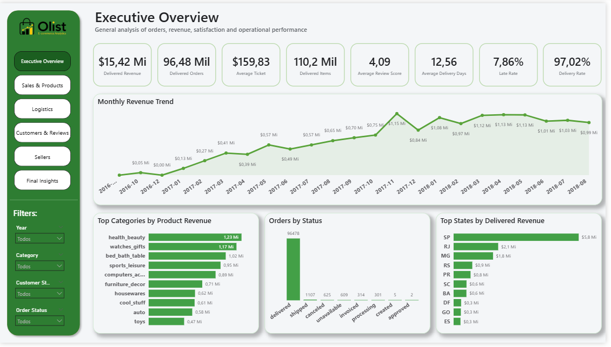
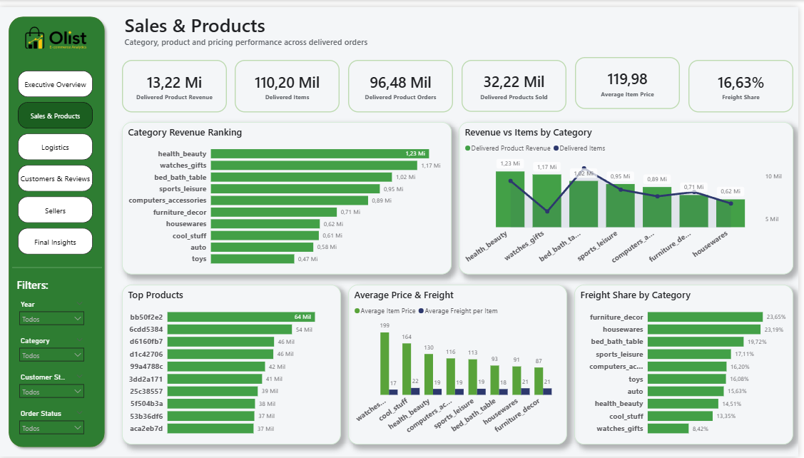
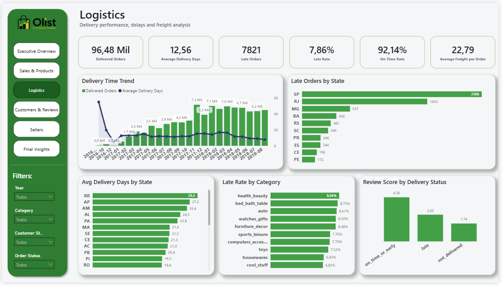
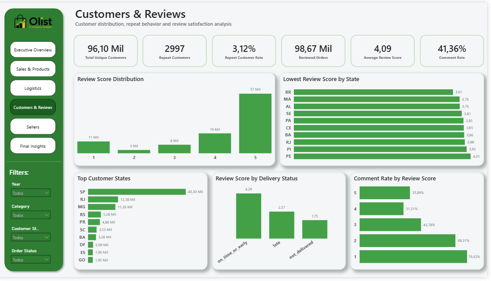
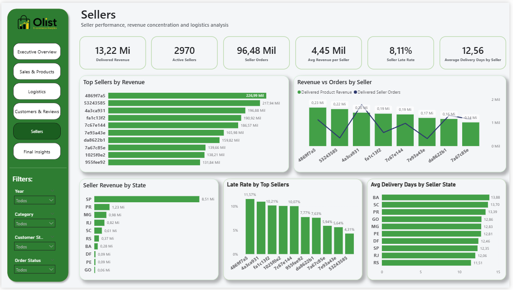
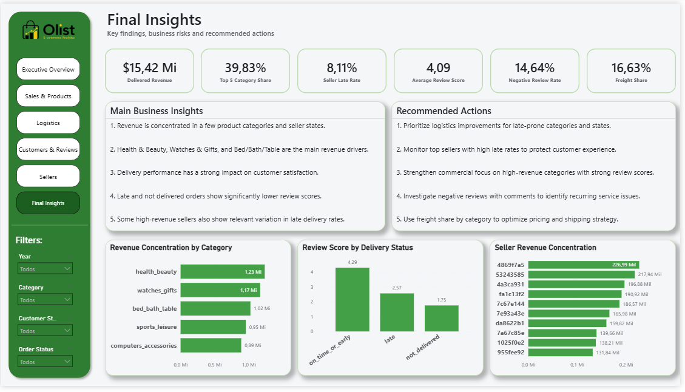

# Olist E-commerce Analytics

End-to-end data analytics project using **Python, MySQL and Power BI** to analyze sales, logistics, customers, reviews and seller performance in a Brazilian e-commerce marketplace.

---

## Project Objective

The objective of this project was to simulate a real-world data analytics workflow, starting from raw CSV files and ending with an interactive analytical dashboard in Power BI.

The project covers the following steps:

- Data cleaning and preparation with Python
- MySQL database creation
- Primary key and relationship validation with SQL
- Dimensional modeling for Power BI
- DAX measure creation
- Interactive dashboard development
- Business insights and strategic recommendations

---

## Tools Used

- Python
- Pandas
- MySQL
- SQL
- Power BI
- DAX
- GitHub

---

## Project Structure

```text
olist-ecommerce-analytics/
│
├── data/
│   ├── raw/
│   └── processed/
│
├── notebooks/
│   ├── 01_data_understanding.ipynb
│   ├── 02_data_cleaning.ipynb
│   └── 03_load_to_mysql.ipynb
│
├── sql/
│   ├── 01_create_database_and_tables.sql
│   ├── 02_validation_queries.sql
│   ├── 03_create_views.sql
│   └── 04_powerbi_views.sql
│
├── powerbi/
│   └── Power BI file available upon request
│
├── images/
│   ├── executive_overview.png
│   ├── sales_products.png
│   ├── logistics.png
│   ├── customers_reviews.png
│   ├── sellers.png
│   └── final_insights.png
│
└── README.md
```

---

## Project Steps

### 1. Data Preparation with Python

The first step was performed using Python and the Pandas library.

The raw datasets were inspected to understand table structures, missing values, duplicated records, data types and business relationships.

Several analytical columns were created to support the SQL model and Power BI dashboard.

Examples of created columns:

- `delivery_time_days`
- `delivery_delay_days`
- `delivery_status`
- `is_late`
- `item_total_value`
- `product_volume_cm3`
- `has_review_comment`

---

### 2. Data Loading and Modeling with MySQL

After the cleaning process, the processed datasets were loaded into MySQL.

Staging tables and analytical views were created to organize the data before connecting it to Power BI.

Several validations were performed, including:

- Primary key validation
- Composite key validation
- Relationship validation between tables
- Row count validation
- Consistency checks between item revenue and payment values

---

### 3. Power BI Data Model

The final analytical layer for Power BI was structured using dimension and fact tables:

- `dim_customers`
- `dim_sellers`
- `dim_products`
- `fact_orders`
- `fact_order_items`
- `fact_payments_by_order`
- `fact_reviews_by_order`

This structure allowed a cleaner model, reduced duplication risks and made DAX measure creation more reliable.

---

## Power BI Dashboard

The dashboard was divided into six analytical pages.

## Power BI File

The `.pbix` file is not included in this repository due to GitHub file size limitations.

The dashboard can be reviewed through the screenshots available in the `images/` folder.

The Power BI file is available upon request.

## Live Dashboard

The interactive Power BI dashboard is available at the link below:

[Open Power BI Dashboard](https://app.powerbi.com/view?r=eyJrIjoiYjJiYWQyZjItNjYxYS00Yjg1LWJmNjYtNGQ4NzI2MTkxNGVhIiwidCI6ImFlMTA1MWE2LWE0NzYtNGJkYi04OTFhLWMwOWVhYmQ5ZjZlYSJ9))

---

### Executive Overview

High-level view of revenue, orders, average ticket, delivered items, average review score, average delivery time, late rate and delivery rate.



---

### Sales & Products

Analysis of product revenue, category performance, top products, average item price, average freight and freight share by category.



---

### Logistics

Operational analysis of delivery performance, including average delivery time, late orders, late rate by category, delays by state and the impact of delivery status on customer reviews.



---

### Customers & Reviews

Analysis of unique customers, repeat customers, review score distribution, comment rate and customer satisfaction by delivery status.



---

### Sellers

Seller performance analysis, including revenue concentration, seller states, seller late rate and average delivery time by seller state.



---

### Final Insights

Final page summarizing the main findings, business risks and strategic recommendations.



---

## Key Business Insights

Some of the main insights identified in the analysis:

1. Revenue is concentrated in a few product categories and seller states.
2. Health & Beauty, Watches & Gifts and Bed/Bath/Table are the main revenue drivers.
3. Logistics performance has a strong impact on customer satisfaction.
4. Late and not delivered orders have significantly lower average review scores.
5. Dissatisfied customers are more likely to leave written comments.
6. Some high-revenue sellers also show relevant variation in late delivery rates.
7. Freight share varies significantly by category and should be monitored as part of the commercial and logistics strategy.

---

## Business Recommendations

Based on the analysis, the main recommendations are:

1. Prioritize logistics improvements in categories and states with higher late rates.
2. Monitor high-revenue sellers that also show higher late delivery rates.
3. Strengthen commercial focus on high-revenue categories with strong customer satisfaction.
4. Investigate negative reviews with written comments to identify recurring operational issues.
5. Use freight share by category to support pricing and shipping strategy decisions.

---

## Skills Demonstrated

This project demonstrates practical experience in:

- Data cleaning with Python
- Data manipulation with Pandas
- MySQL database modeling
- SQL queries and validation
- Dimensional modeling
- Power BI dashboard development
- DAX measure creation
- Data storytelling
- Business-oriented analysis
- Portfolio project documentation

---

## Project Status

Project completed.

Possible future improvements:

- Customer cohort analysis
- Seller segmentation
- Late delivery prediction
- Sentiment analysis on review comments
- Dashboard publication in Power BI Service
